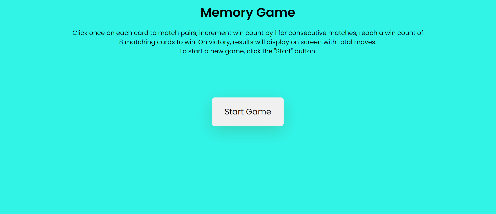
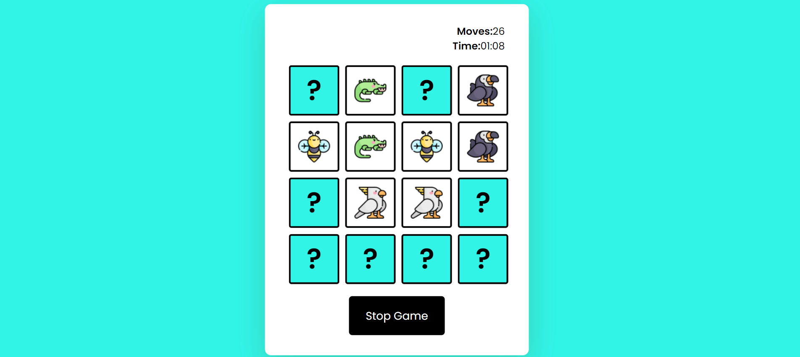
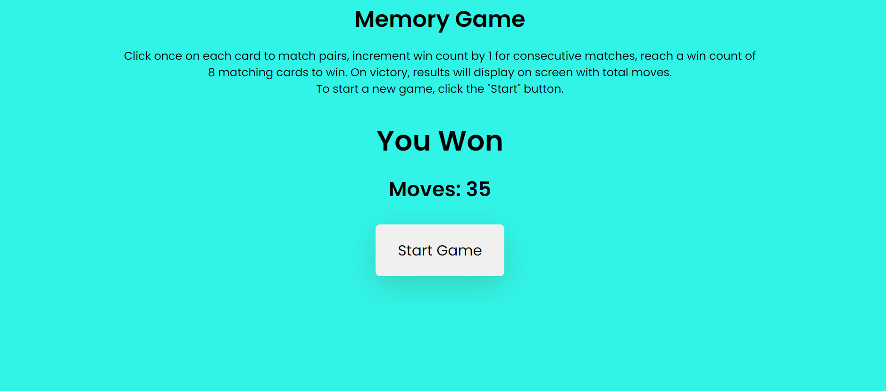

# Memory Game

Memory Game is a fully responsive website designed to captivate and entertain users while simultaneously providing a platform for enhancing their cognitive abilities. Tailored for individuals seeking a fun and interactive way to boost memory skills, this website offers a dynamic and visually appealing memory game experience.

Upon entering the site, users are greeted with an intuitive interface that promotes ease of navigation. The well-crafted design invites players to immerse themselves in a stimulating challenge that combines entertainment with cognitive development. The user-friendly layout ensures a seamless experience for players of all ages and backgrounds.

The core feature of the website is the memory game itself, a thoughtfully crafted activity that prompts users to match pairs of images within a specified time frame. As players progress through different levels, the complexity of the game increases, providing a progressive and rewarding journey. The game not only entertains but also serves as a valuable tool for honing memory retention and concentration skills.

Moreover, Memory Game incorporates responsive design elements, making it accessible across various devices, including desktops, tablets, and smartphones. This adaptability ensures that users can enjoy the game seamlessly, regardless of their preferred device.

# Features
This is a fully responsive website that was designed with a mobile-first approach as this is the most likely way it will be viewed, the game is divided in different sections as listed below.Memory Game stands as a testament to the fusion of entertainment and cognitive enhancement. With its thoughtful design, engaging gameplay, and user-friendly interface, this website strives to create an enjoyable and enriching experience for individuals seeking both amusement and mental stimulation.

## User-Friendly Interface.
- Intuitive design for easy navigation.
- Clear instructions on how to play the game.

## Stats Button

- The "Stats" button this will lead to a dedicated section where users can view detailed functionaliy about the game.
- Users can also click on start button to start a new game as instructed in the decsription.

## Stop Button

- The stop button is applied to the Meomory Game for the user to stop the game if the user gets intterupted while playing to start afresh. 

## The Game Area
- The central element of the website is the game area, featuring a grid of face-down cards that users can interact with. Clicking on each card once to reveal their content while playing.

## Timer Display
- The game is timed, Time and moves will be prominently displayed when playing and at the end of matching all pairs of Memory game challenge.

## Score Display
- Memory Game will Show the user's "YOU WON" and total moves made after matching all pairs of the game, updating in real-time as they make successful matches.

